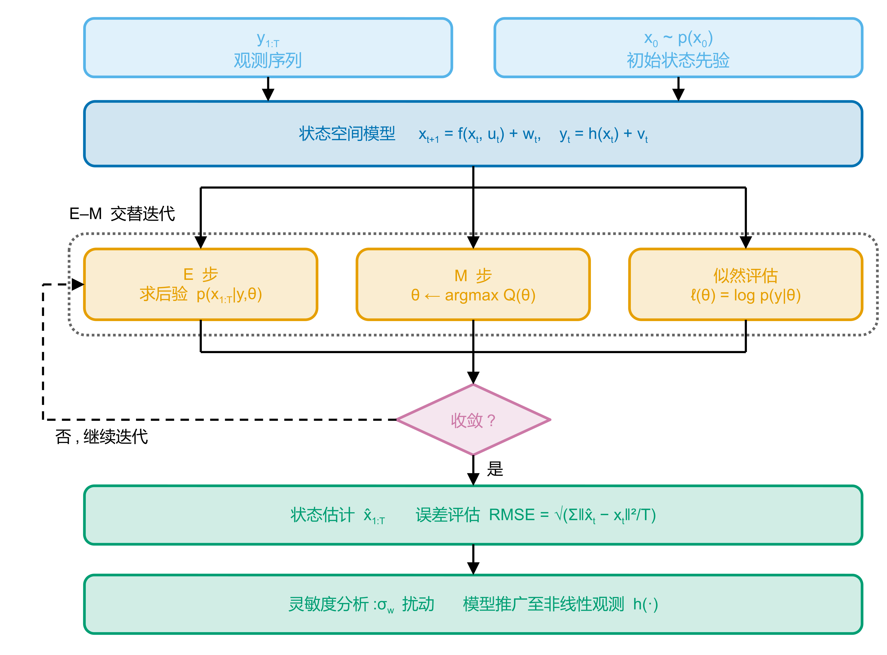
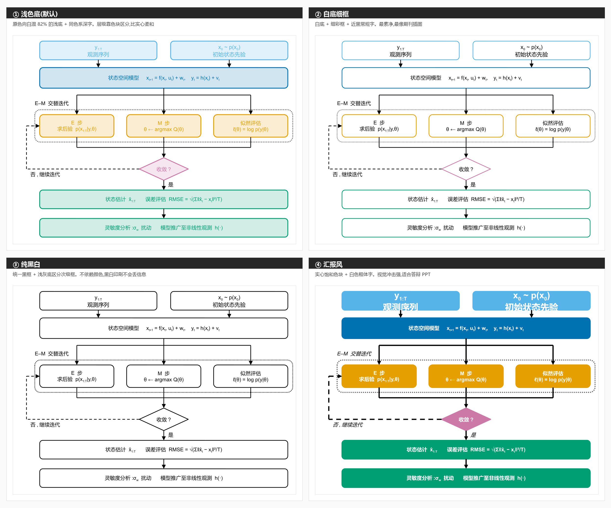

# ppt-diagram

> Generate **editable** academic schematic figures — method frameworks, pipelines,
> module diagrams — as PPTX from code, nudge them by hand in PowerPoint, then export
> print-ready 600 DPI PNG or vector SVG.
>
> **Why not draw it directly?** Because you can still change it. Code gives you exact
> alignment; PowerPoint gives you a mouse. Do both: generate a skeleton, drag it around
> yourself, then export. The result is a figure you can actually revise at 2am before
> a deadline, not a frozen PNG.
>
> **Install:** `/plugin marketplace add 2675149875/ppt-diagram` in Claude Code,
> or `git clone` this repo into `~/.claude/skills/ppt-diagram`. Needs
> `python-pptx`, LibreOffice, and poppler. See [安装](#安装).

用代码生成**可编辑的**学术示意图,在 PowerPoint 里手动微调,最后导出成论文可用的
高分辨率 PNG 或矢量 SVG。



---

## 这是什么

一个 Claude Code skill,专治「论文里那张方法框架图」。

它做三件事:

1. **代码生成骨架** —— 精确对齐,不用对齐辅助线戳半天
2. **你在 PowerPoint 里拖拽微调** —— 位置、措辞、配色,改到你满意
3. **程序导出成图** —— 600 DPI PNG 或矢量 SVG,直接插进 Word

适用:方法框架图、流程管线图、模块关系图、技术路线图、系统架构图、对比示意图。

**不适用**:数据图(曲线、散点、热力图)—— 那是 matplotlib / seaborn 的活。
这里画的是**形状 + 箭头**的示意图,不是从数值画出来的图。

## 三步工作流

```
① 生成 PPTX  ──→  ② 你在 PowerPoint 里微调  ──→  ③ 导出成图
   (代码，精确对齐)      (拖拽、改字、换色)          (600 DPI PNG / 矢量 SVG)
```

第 ③ 步如果不想敲命令,把调好的 `.pptx` **拖到 `export.cmd` 图标上**松手就行。

## 安装

### 依赖

| 组件 | 用途 | 怎么装 |
|---|---|---|
| Python 3.9+ / `python-pptx` | 生成 PPTX | `pip install -r requirements.txt` |
| **LibreOffice** | PPTX → 矢量 PDF | Windows `winget install TheDocumentFoundation.LibreOffice` · macOS `brew install --cask libreoffice` · Linux `sudo apt install libreoffice` |
| **poppler**(`pdftocairo`) | PDF → PNG / SVG | Windows:下载 poppler 并把 `bin/` 加进 PATH · macOS `brew install poppler` · Linux `sudo apt install poppler-utils` |
| Pillow *(可选)* | 只有四风格对比图用 | `pip install Pillow` |

### 装 skill

**方式一:Claude Code 插件**

```
/plugin marketplace add 2675149875/ppt-diagram
/plugin install ppt-diagram@ppt-diagram
```

**方式二:直接克隆到 skills 目录**

```bash
git clone https://github.com/2675149875/ppt-diagram.git ~/.claude/skills/ppt-diagram
```

重开一个会话,说「帮我画个方法框架图」就会触发。

### 工具路径不用手改

`soffice` 和 `pdftocairo` 的安装位置因机器而异,所以代码里不写死路径。
查找顺序是 **环境变量 → PATH → 几个常见安装目录**。装在非标准位置就设环境变量:

```powershell
$env:PPT_DIAGRAM_SOFFICE    = "D:\PortableApps\LibreOffice\program\soffice.com"
$env:PPT_DIAGRAM_PDFTOCAIRO = "D:\Tools\poppler\bin\pdftocairo.exe"
```

看当前解析到了哪里:

```bash
python scripts/tools.py
```

## 快速上手

```python
import sys, os
sys.path.insert(0, os.path.expanduser("~/.claude/skills/ppt-diagram/scripts"))
from diagram_kit import Diagram

# 画布宽度取论文版心 —— 这样字号就是最终印刷字号
d = Diagram(width_in=5.77, height_in=2.90)

# box() 返回 Node 句柄,箭头靠它取边框坐标 —— 不用手算半宽
a = d.box(0.16, 0.30, 2.60, 0.60, "y_{1:T}\n观测序列", style="sky")
b = d.box(3.01, 0.30, 2.60, 0.60, "x_0 ~ p(x_0)\n初始状态先验", style="sky")
m = d.box(0.16, 1.30, 5.45, 0.55,
          "状态空间模型  x_{t+1} = f(x_t) + w_t", style="blue", size=7.5)

# 落点对准源框中线 → 箭头完全竖直(随手取落点会变斜箭头,斜线是"显乱"的主因)
for src in (a, b):
    d.arrow(*src.bottom, *m.port("top", (src.cx - m.x) / m.w))

# 一个源分发给多个并行步骤:用 bus(),别各画一条线
steps = [d.box(0.16 + i * 1.86, 2.20, 1.60, 0.50,
               f"步骤 {i+1}\n具体算子", style="orange", size=7.5)
         for i in range(3)]
d.bus(m, steps)

# 自查:盒子重叠 / 箭头杆过短 / 斜箭头 / 内容出画布
for issue in d.audit():
    print("⚠️", issue)

d.save("fig1.pptx")
```

完整参考版式见 [`scripts/example_figure.py`](scripts/example_figure.py) ——
五层主链 + 树形分叉 + 汇聚判据 + 虚线回路 + 分组容器,注释逐条对着质量要求写。
跑 `python scripts/example_pipeline.py` 直接出图。

## 图形质量要求(不只是"好看")

箭头一律**连到边框**(`connect()` 让这条结构上成立,不是靠肉眼对齐);
带箭头的线段要有最小杆长,否则箭尖孤零零地飘着;走线正交、不用斜箭头;
框线粗、连接线细;**框内写具体公式/算子而不是"数据输入与预处理"这类泛称**;
不用投影和渐变。完整清单和理由见
[SKILL.md「图形质量要求」](SKILL.md#图形质量要求)。

`d.audit()` 会替你查其中可程序化的部分(重叠、短箭头、斜箭头、出画布)。

## 导出

```powershell
# 默认 600 DPI PNG + 矢量 SVG
.\scripts\export_figure.ps1 -Pptx .\fig1.pptx

# 只要 300 DPI 的 PNG
.\scripts\export_figure.ps1 -Pptx .\fig1.pptx -Formats png -Dpi 300

# 全都要
.\scripts\export_figure.ps1 -Pptx .\fig1.pptx -Formats png,svg,pdf -OutDir .\out
```

或把 `.pptx` **拖到 `export.cmd` 上**。这个脚本跟 PPT 内容无关 —— 任何 pptx 都能转,
多页每页一张、单页不带编号。

| 格式 | 矢量 | 能插 Word | 何时用 |
|---|---|---|---|
| **SVG** | ✅ | ✅ Word 2016+ | **首选**。无限放大不糊,还能右键「转换为形状」编辑 |
| **PNG** | ❌ | ✅ 任何版本 | 期刊要求位图时用;600 DPI 足够印刷 |
| PDF | ✅ | ❌ | 中间产物,投期刊时直接交 |

## 四种风格

`Diagram(..., theme=...)` 四选一。**配色永远是 Okabe-Ito,theme 只决定怎么用色。**



| theme | 填充 | 文字 | 适合 |
|---|---|---|---|
| `presentation` | 实心饱和色 | 白色粗体 | 答辩 / 汇报 PPT(画布 10 英寸,字号 13) |
| **`tinted`**(默认) | 原色向白混 82% | 同色系深色 | 论文主图,层级靠色块区分 |
| `academic` | 白 | 近黑 | 最素净的期刊插图风 |
| `mono` | 白(次级框浅灰) | 黑 | 黑白印刷 / 不依赖颜色 |

跑 `python scripts/style_gallery.py` 可以自己生成上面这张对比图。

## 一些刻意的设计

**配色用 Okabe-Ito 色盲友好色板**([Okabe & Ito 2008](https://jfly.uni-koeln.de/color/))。
约 8% 的男性有色觉障碍,这套色板能保证他们也能区分。八个色:`#0072B2` `#E69F00`
`#009E73` `#56B4E9` `#D55E00` `#CC79A7` `#F0E442` `#666666`。

**字体:拉丁 Arial / 中文 微软雅黑。** 中文字符必须显式设 east-asian 字体,
否则部分环境会回落成宋体 —— 代码里已处理。

**上下标是真上下标**,用 OOXML 的 `baseline` 属性,不是 Unicode 上下标字符
(那种字符集不全,缺字变方框,还没法在 PowerPoint 里编辑)。写法:`C_t` 下标、
`a^2` 上标、`H_{t-1}` 多字符下标加花括号。**文本里的字面下划线要转义成 `\_`**
(`model_v2` 会被当成下标,写 `model\_v2` 才对)。

**画布不写图注。** 图注一旦画进画布就会被烤进导出的 PNG/SVG,插进论文后跟 Word
自己的题注段落重复。编号和标题交给 Word 的「引用 → 插入题注」—— 那才是它的活。

**不用 PowerPoint COM 导出。** `New-Object -ComObject PowerPoint.Application` 在
受限/沙箱环境下常报 `80080005 CO_E_SERVER_EXEC_FAILURE`,还会意外启动 PowerPoint
弹加载项错误框。导出统一走 LibreOffice 无头模式。

## 画布尺寸(最常踩的坑)

**画布宽度必须等于这张图在论文里的最终宽度(版心宽),不能拍脑袋用 10 英寸。**

10 英寸画布插进版心 5.77 英寸的 Word 会被缩到 0.577 倍,图里的 8pt 落到纸面只剩
**4.6pt**,低于所有期刊的下限。**画布 = 版心,字号才所见即所得。**

| 纸张 | 左右页边距 | 版心宽 |
|---|---|---|
| A4 | 3.17cm | **5.77 英寸** |
| A4 | 2.5cm | 6.30 英寸 |
| Letter | 1 英寸 | 6.50 英寸 |

## 已知限制

- **导出链(`export_figure.ps1` / `export.cmd`)只在 Windows 上实测过。**
  `diagram_kit.py`、`tools.py` 是纯 Python,跨平台没问题。macOS / Linux 用户可以
  直接用 `style_gallery.py`(它内部调 soffice + pdftocairo),或照它的 `export_png()`
  自己拼一条命令。
- **`elbow()` 走线不可控。** 直角走线由 PowerPoint / LibreOffice 各自的算法决定,
  两边可能不一致。要精确控制就改用多段 `arrow()` 拼。
- **`pdftocairo` 不支持非 ASCII 路径**,所以导出时先在 ASCII 临时目录转换再搬回
  目标位置(`export_figure.ps1` 已处理)。
- **上下标不缩字号** —— `baseline` 只移基线。长上下标(如 `ŷ^{(ensemble)}`)会明显
  偏大,控制在 1~2 字符。

## 目录结构

```
ppt-diagram/
├── SKILL.md                    # skill 正文（Claude 读的），含完整 API 与踩坑记录
├── README.md
├── LICENSE                     # MIT
├── requirements.txt
├── export.cmd                  # 拖拽导出入口（Windows，纯 ASCII + CRLF）
├── .claude-plugin/             # Claude Code 插件清单
├── docs/                       # README 配图
└── scripts/
    ├── diagram_kit.py          # 画图 API（核心）
    ├── example_figure.py       # ★ 参考版式在这 —— 想学怎么画就读它
    ├── tools.py                # 定位 soffice / pdftocairo
    ├── export_figure.ps1       # 导出成图（Windows PowerShell）
    ├── example_pipeline.py     # 出一张 pptx
    └── style_gallery.py        # 四风格拼版对比
```

**[SKILL.md](SKILL.md) 才是主文档** —— 里面有完整 API 表、版面建议、以及一条条
实测出来的坑(文字溢出、导出带投影、中文变宋体、.cmd 编码陷阱……)。
README 只是门面。

## License

[MIT](LICENSE)
